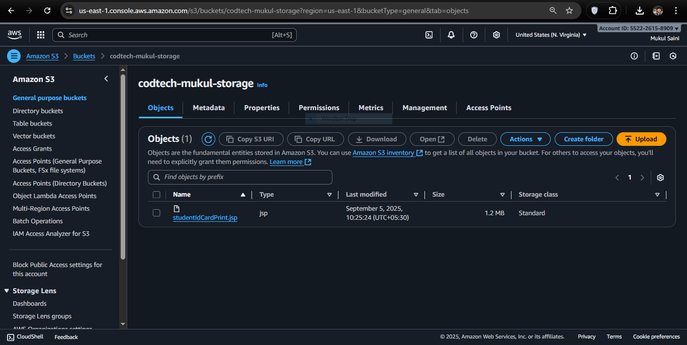

# Task 1 – Cloud Storage Setup

## Objective
Create and configure cloud storage on AWS S3 and upload files.

## Steps Performed
1. Logged in to AWS Management Console.  
2. Navigated to **S3** service.  
3. Created a bucket named **codtech-mukul-storage** in region **ap-south-1 (Mumbai)**.  
4. Configured bucket settings and uploaded a sample file (`studentIdCardPrint.jsp`).  
5. Verified successful upload (1.2 MB).  
6. Checked object properties and access permissions.

## Screenshots
### 1. Bucket Creation

### 2. File Upload

### 3. File Permissions

## Conclusion
Successfully created an S3 bucket, uploaded files, and configured access.

